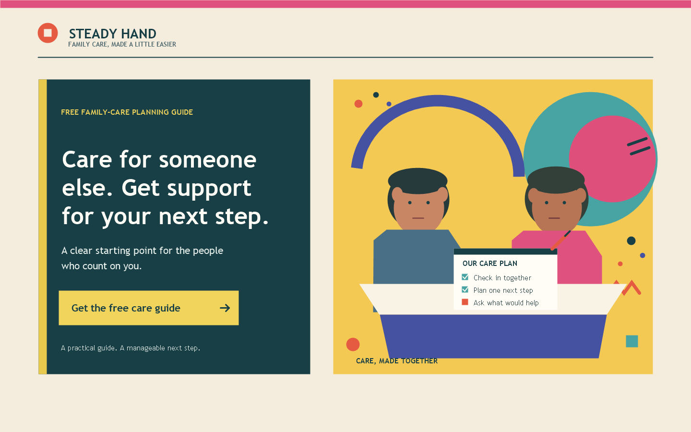

# Caregiver
[Back to this section](README.md) · [Home](../README.md)

## What is it?
The Caregiver is a brand archetype organized around protecting, supporting, and helping others. In Margaret Mark and Carol S. Pearson's brand-archetype framework, its central promise is compassionate service: make people feel supported and safer. It is a strategic storytelling model, not a clinical personality type or evidence that a company is caring.

## How do you recognize or use it?
Look for a patient, reassuring voice; clear explanations; welcoming, respectful imagery; and practical help that reduces someone's burden. It can suit health and family services, education, charities, and products built around care or safety. Make the support concrete, preserve the audience's agency, and avoid pity, guilt, overpromising, or presenting self-sacrifice as the caregiver's duty.

### Example 1

Persuasion: Reciprocity
Headline: Gentle on Skin. Honest in Care
CTA: **Claim Your Complimentary Care Guide** — delivers a digital textile care handbook.

### Example 2

Archetype: Caregiver
Style: [Memphis (postmodernist)](../postmodernism/memphis_group.md)
Persuasion: Reciprocity
Headline: Care for someone else. Get support for your next step.
CTA: **Get the free care guide** — opens the guide download.

## Sources
- Mark, Margaret, and Carol S. Pearson. *The Hero and the Outlaw: Building Extraordinary Brands Through the Power of Archetypes*. McGraw-Hill, 2001. Framework for the Caregiver archetype.
- [Robert Cialdini, Influence at Work: The Science of Persuasion](https://www.influenceatwork.com/7-principles-of-persuasion/). Reciprocity principle; the free-guide application above is hypothetical.
