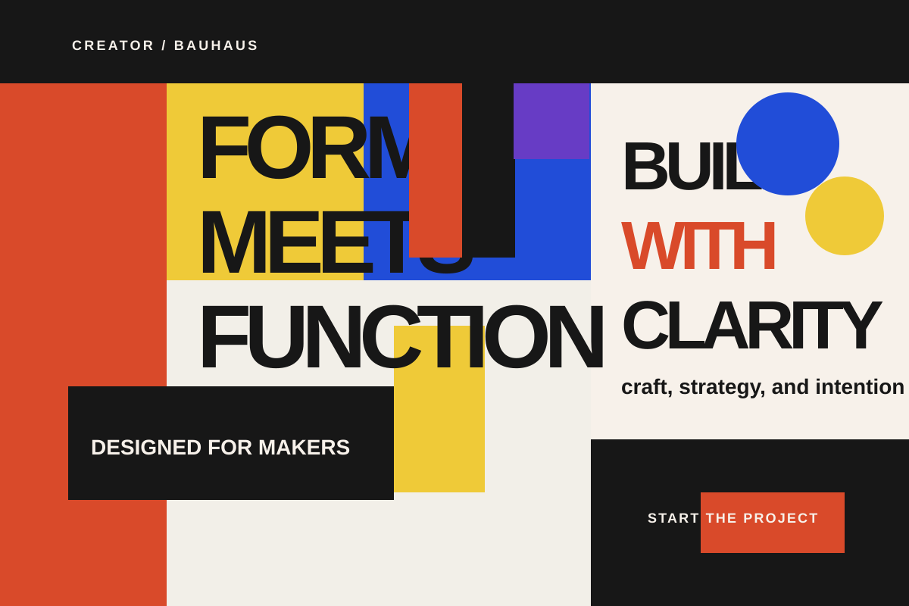

# Creator
[Back to this section](README.md) · [Home](../README.md)

## What is it?
The Creator archetype is defined by originality, craft, and the need to make something with personal vision. In Jungian psychology, archetypes are recurring patterns in human experience; the Creator corresponds to the urge to shape raw material into a meaningful form, whether that material is paint, code, furniture, writing, or a product concept. In branding and design, the archetype often signals authorship, experimentation, and a preference for making over copying. Historically, it connects to modernist ideas of the designer as maker and to postmodern creative practices that treat form, material, and storytelling as expressive tools rather than fixed rules.

## How do you recognize or use it?
You recognize the Creator archetype by language and visual choices that emphasize originality, craft, and authorship. The people it speaks to are usually motivated by self-expression, experimentation, quality, and the pleasure of making; they value bespoke work, process, and authenticity over mass-produced sameness. In a hero section, it works well for creative tools, studios, maker brands, design platforms, and product launches that want to frame the offer as developed from scratch rather than assembled from templates. Typical cues include phrases like “designed from the ground up,” “made by hand,” “custom-built,” or “built for makers,” paired with textures, sketches, tools, workshop imagery, asymmetrical layouts, and a more editorial or handcrafted aesthetic.

### Example 1

Archetype: Creator
Style: [Bauhaus](../styles/modernism/bauhaus.md)
Persuasion: Authority
Headline: "Form meets function."
CTA: "Start the project"

This version frames the Creator archetype as a disciplined maker: precise, intentional, and confident in turning raw ideas into useful, crafted outcomes. The Bauhaus-inspired geometry, primary-color system, and streamlined type treatment communicate expertise and clarity, while the authority-led CTA reinforces trust and production-ready capability. Generated image: this SVG was created for this project and adapts Bauhaus design principles rather than reproducing a specific historical work.

### Example 2

Archetype: Creator
Style: [Vaporwave](../style/postmodernism/vaporwave.md)
Persuasion: Liking
Headline: "Make it your way."
CTA: "Start the project"

This version keeps the Creator archetype rooted in originality and experimentation, but gives it a more immersive, neon-soaked energy through layered gradients, retro type, and a synth-driven mood. Vaporwave is a strong match for the archetype because it frames making as a personal and expressive act, while the inviting CTA makes the brand feel collaborative rather than rigid. Generated image: this SVG was created for this project and is inspired by vaporwave design language rather than reproducing a historical poster.

## Sources
- Britannica, “Archetype,” https://www.britannica.com/topic/archetype-psychology — overview of the psychological concept behind archetypes and their recurring patterns in human thought and culture.
- Carl Jung, “The Archetypes and the Collective Unconscious,” https://www.britannica.com/topic/archetype-psychology — foundational explanation of archetypes as universal symbolic patterns.
- Margaret Mark and Carol S. Pearson, The Hero and the Outlaw: Building Extraordinary Brands Through the Power of Archetypes, https://www.amazon.com/Hero-Outlaw-Building-Extraordinary-Archetypes/dp/0071357174 — a widely cited branding framework that defines archetypes including the Creator and explains how they shape audience perception.
- The Bauhaus, https://www.bauhaus.de/en/ — official Bauhaus site with historical context and design principles.
- Victoria and Albert Museum, “What is Postmodernism?”, https://www.vam.ac.uk/articles/what-is-postmodernism — concise overview of postmodern design principles, including Memphis, theatrical color, and stylistic complexity.

