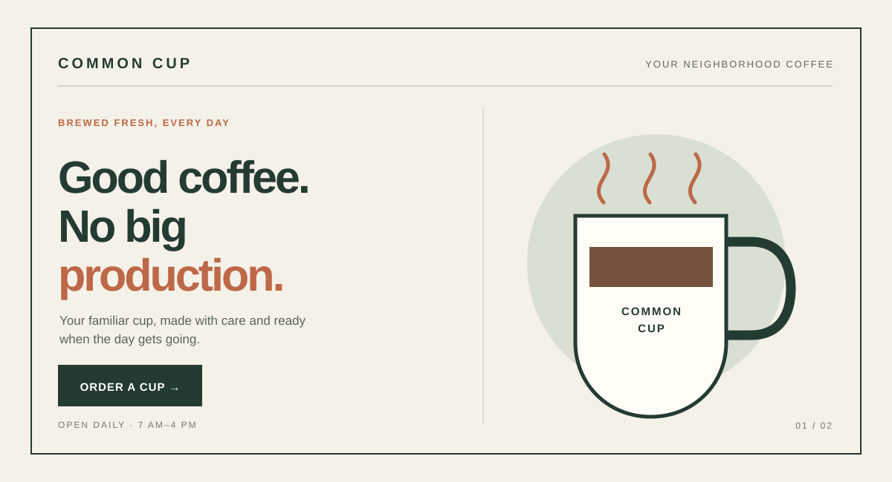
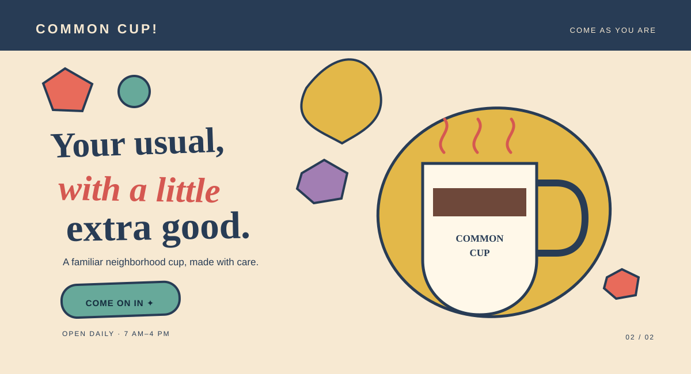

# The Everyman
[Back to this section](README.md) · [Home](../README.md)

## What is it?

The Everyman, also called the Regular Guy/Gal or Everyperson in Carol S. Pearson's archetype framework, is centered on belonging, equality, and everyday connection. It values being accepted as one of the group and finding common ground with others. In branding, it often comes across as unpretentious, relatable, practical, and welcoming. [Carol S. Pearson, “Realist Archetype”](https://carolspearson.com/archetype-pages/orphan-archetype)

## How do you recognize or use it?

Look for familiar language, ordinary settings, inclusive imagery, and an approachable tone that avoids status signals or insider jargon. The archetype can suit everyday services and products that aim to be dependable and easy to join, such as neighborhood shops, food, or community activities. Use specific, realistic details and make the offer feel open to people like the audience; avoid pretending to speak for everyone.

## Examples

Both original hero concepts below promote the same fictional offer: Common Cup, a neighborhood coffee shop. The mockups use original vector illustrations and make no claims about real customers or popularity.

### Example 1 — Modernist

Archetype: Everyman  
Style: [Bauhaus graphic design and modernist grid](https://www.moma.org/explore/inside_out/2009/11/06/bauhaus-the-graphic-design-department-goes-back-to-school/)  
Persuasion: [Liking](https://assessment.cialdini.com/types/liking)  
Headline: “Good coffee. No big production.”  
CTA: “Order a cup” — opens the fictional café's order page.

The clear grid, practical hierarchy, and simple cup illustration make the offer direct and easy to understand. Plainspoken copy signals that Common Cup is an everyday place without fuss; its familiar tone aims to build liking through relatability rather than status or unsupported popularity claims.

### Example 2 — Postmodernist

Archetype: Everyman  
Style: [Memphis design and postmodernism](https://www.vam.ac.uk/articles/what-is-postmodernism)  
Persuasion: [Liking](https://assessment.cialdini.com/types/liking)  
Headline: “Your usual, with a little extra good.”  
CTA: “Come on in” — opens the fictional café's welcome page.

Bright shapes and an intentionally loose composition bring a playful postmodern flavor while keeping the coffee and invitation easy to recognize. The familiar phrase “your usual” positions the shop as part of an ordinary routine, while the friendly CTA keeps the Everyman tone welcoming and approachable.

## Sources

- [Carol S. Pearson, “Realist Archetype”](https://carolspearson.com/archetype-pages/orphan-archetype) — Pearson identifies Everyperson and Regular Guy/Gal as subtypes of this archetype and describes its shared vulnerabilities and common touch.
- [MoMA, “Bauhaus: The Graphic Design Department Goes Back to School”](https://www.moma.org/explore/inside_out/2009/11/06/bauhaus-the-graphic-design-department-goes-back-to-school/) — reference for grid and typography; the hero is an original adaptation.
- [V&A, “What is Postmodernism?”](https://www.vam.ac.uk/articles/what-is-postmodernism) — historical context for postmodern design; the hero is an original adaptation.
- [Cialdini Institute, “Liking”](https://assessment.cialdini.com/types/liking) — persuasion framework; the examples apply it through similarity and familiarity.
- Image credits: both hero illustrations are original SVGs created for this project; no external images are used.
