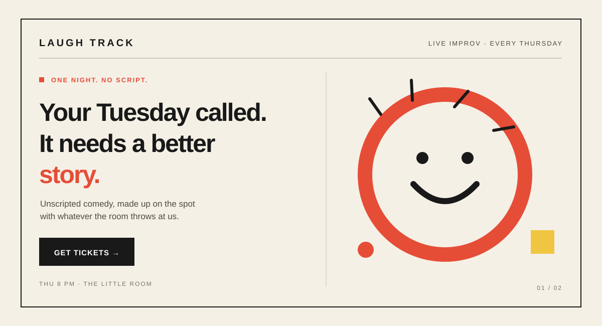
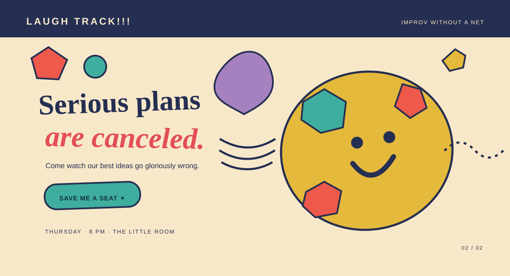

# The Jester
[Back to this section](README.md) · [Home](../README.md)

## What is it?

The Jester is an archetype centered on play, humor, wit, and enjoying the present. In Carol S. Pearson's 12-archetype system, the Jester uses ingenuity and humor to help people see the value of fun and lighten stressful situations. In branding, it can make an experience feel entertaining, spontaneous, and human. Humor should invite people in without belittling or excluding them. [Carol S. Pearson, “Jester Archetype”](https://carolspearson.com/archetype-pages/jester-archetype)

## How do you recognize or use it?

Look for playful language, visual surprises, irreverence, and a willingness to poke fun at everyday frustrations or at the brand itself. The Jester can work well for entertainment, snacks, social experiences, or any offer where a lighter mood is part of the appeal. Use jokes that suit the audience and the moment; humor that feels mean, confusing, or forced can undermine trust.

## Examples

Both original hero concepts below promote the same fictional offer: Laugh Track, a neighborhood improv comedy night. The mockups are original vector illustrations with no borrowed imagery.

### Example 1 — Modernist

Archetype: Jester  
Style: [Bauhaus graphic design and modernist grid](https://www.moma.org/explore/inside_out/2009/11/06/bauhaus-the-graphic-design-department-goes-back-to-school/)  
Persuasion: [Liking](https://assessment.cialdini.com/types)  
Headline: “Your Tuesday called. It needs a better story.”  
CTA: “Get tickets” — opens the fictional show's ticket page.

The strong grid, geometric shapes, and clear typographic hierarchy take cues from Bauhaus graphic design and make the event details easy to scan. The personified Tuesday and friendly joke give the Jester concept a relatable voice; the warm humor aims to make the event feel likable and welcoming.

### Example 2 — Postmodernist

Archetype: Jester  
Style: [Memphis design and postmodernism](https://www.vam.ac.uk/articles/what-is-postmodernism)  
Persuasion: [Liking](https://assessment.cialdini.com/types)  
Headline: “Serious plans are canceled.”  
CTA: “Save me a seat” — opens the fictional show's ticket page.

The loud color, decorative geometry, and deliberately offbeat composition echo Memphis and postmodern design's playful challenge to restrained conventions. The headline makes a small joke about routine plans, while the conversational CTA invites the visitor to join the fun; both choices are intended to create affinity through humor.

## Sources

- [Carol S. Pearson, “Jester Archetype”](https://carolspearson.com/archetype-pages/jester-archetype) — description, strengths, and cautions.
- [Carol S. Pearson, “The Pearson 12-Archetype System”](https://carolspearson.com/about/the-pearson-12-archetype-system-human-development-and-evolution) — context for the Jester's role in play, laughter, and enjoyment.
- [MoMA, “Bauhaus: The Graphic Design Department Goes Back to School”](https://www.moma.org/explore/inside_out/2009/11/06/bauhaus-the-graphic-design-department-goes-back-to-school/) — reference for grid and typographic choices; the hero is an original adaptation.
- [V&A, “What is Postmodernism?”](https://www.vam.ac.uk/articles/what-is-postmodernism) — historical context for postmodern design, including Memphis; the hero is an original adaptation.
- [Cialdini Institute, “Cialdini's 7 Principles of Persuasion”](https://assessment.cialdini.com/types) — liking principle.
- Image credits: both hero illustrations are original SVGs created for this project; no external images are used.
