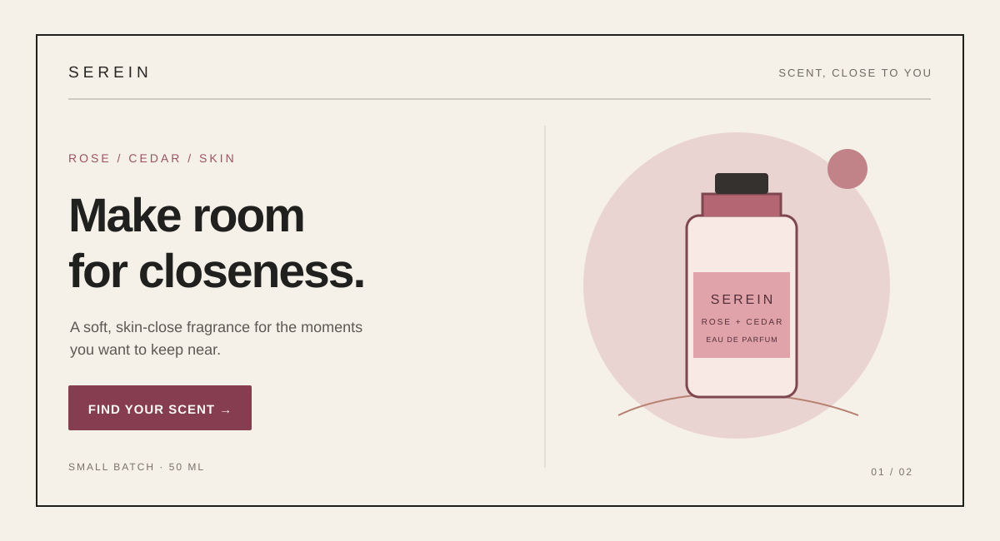
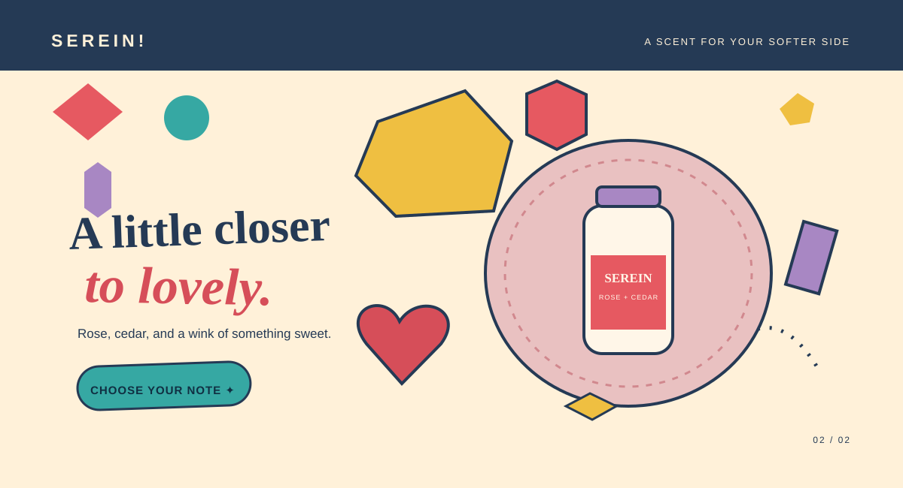

# The Lover
[Back to this section](README.md) · [Home](../README.md)

## What is it?

The Lover is an archetype centered on relationships, connection, appreciation, and passion. In Carol S. Pearson's 12-archetype system, Lover individuals are fulfilled by building relationships and enjoying the richness and fullness of life. In branding, it can be expressed through experiences that emphasize connection, beauty, sensory appeal, and emotional meaning. [Carol S. Pearson, “Lover Archetype”](https://carolspearson.com/archetype-pages/lover-archetype)

## How do you recognize or use it?

Look for communication that emphasizes connection, intimacy, appreciation, beauty, and emotional experience. Warm imagery, expressive language, and sensory details can create a feeling of closeness and personal significance. The archetype can suit brands and experiences where relationships, personal expression, beauty, or enjoyment are central to the audience's experience. Treat it as a creative lens, rather than a claim about every customer's personality.

## Examples

Both original hero concepts below promote the same fictional offer: Serein, a small-batch rose and cedar perfume. The mockups use drawn shapes and typography; they contain no generated or borrowed imagery.

### Example 1 — Modernist

Archetype: Lover  
Style: [Swiss International Typographic Style](https://www.moma.org/collection/works/4885)  
Persuasion: [Liking](https://www.influenceatwork.com/wp-content/uploads/2012/02/Cornell-HotelRestAdminQrtly.pdf)  
Headline: “Make room for closeness.”  
CTA: “Find your scent” — opens the fictional product collection.

The flush grid, sans-serif type, limited palette, and clear hierarchy adapt Swiss Style's emphasis on orderly, legible communication. The close-cropped bottle and intimate line bring the Lover's focus on sensory connection into that structure; the invitation uses liking by framing the fragrance as a personal expression of warmth and closeness.

### Example 2 — Postmodernist

Archetype: Lover  
Style: [Memphis design / postmodernism](https://www.metmuseum.org/art/collection/search/486989)  
Persuasion: [Liking](https://www.influenceatwork.com/wp-content/uploads/2012/02/Cornell-HotelRestAdminQrtly.pdf)  
Headline: “A little closer to lovely.”  
CTA: “Choose your note” — opens the fictional scent selector.

Bright geometric shapes, playful pattern, and a deliberately off-center composition reinterpret Memphis design's vivid forms and challenge to conventional furniture and graphic order. The affectionate headline keeps the Lover theme, while the friendly invitation and expressive product image aim to make the brand feel likable and approachable.

## Sources

- [Carol S. Pearson, “Lover Archetype”](https://carolspearson.com/archetype-pages/lover-archetype) — archetype description and cautions.
- [MoMA, Josef Müller-Brockmann, *Musica Viva*, 1957](https://www.moma.org/collection/works/4885) — reference for the Swiss modernist poster tradition; the hero is an original adaptation, not a reproduction.
- [The Metropolitan Museum of Art, Ettore Sottsass, *Carlton* room divider, 1981](https://www.metmuseum.org/art/collection/search/486989) — Memphis design reference; the hero is an original adaptation, not a reproduction.
- [Robert B. Cialdini and Noah J. Goldstein, “The Science and Practice of Persuasion”](https://www.influenceatwork.com/wp-content/uploads/2012/02/Cornell-HotelRestAdminQrtly.pdf) — liking principle.
- Image credits: both hero illustrations are original SVGs created for this project; no external images are used.
