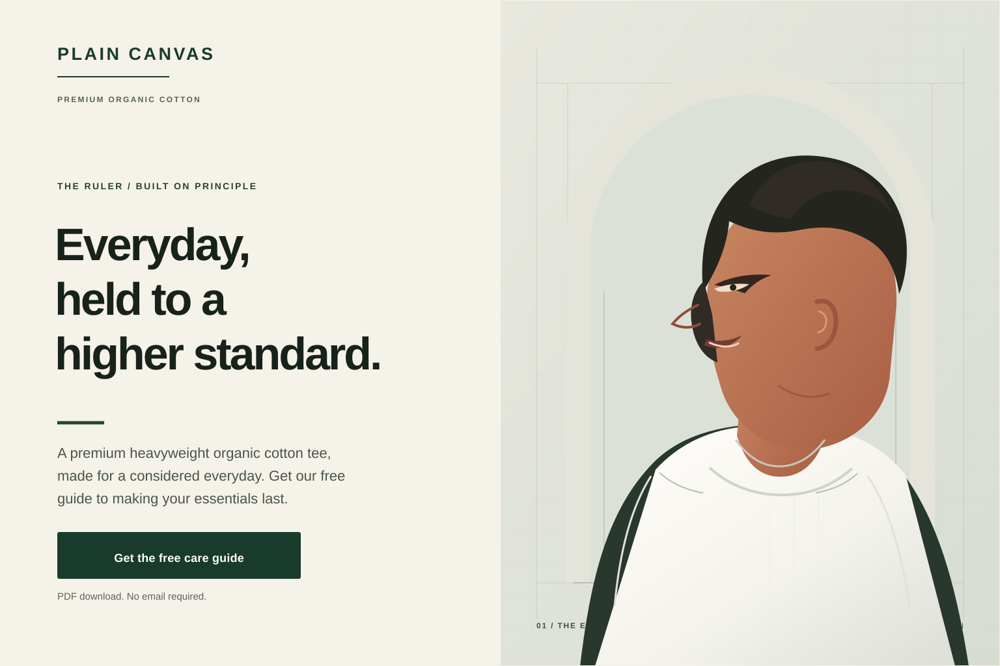
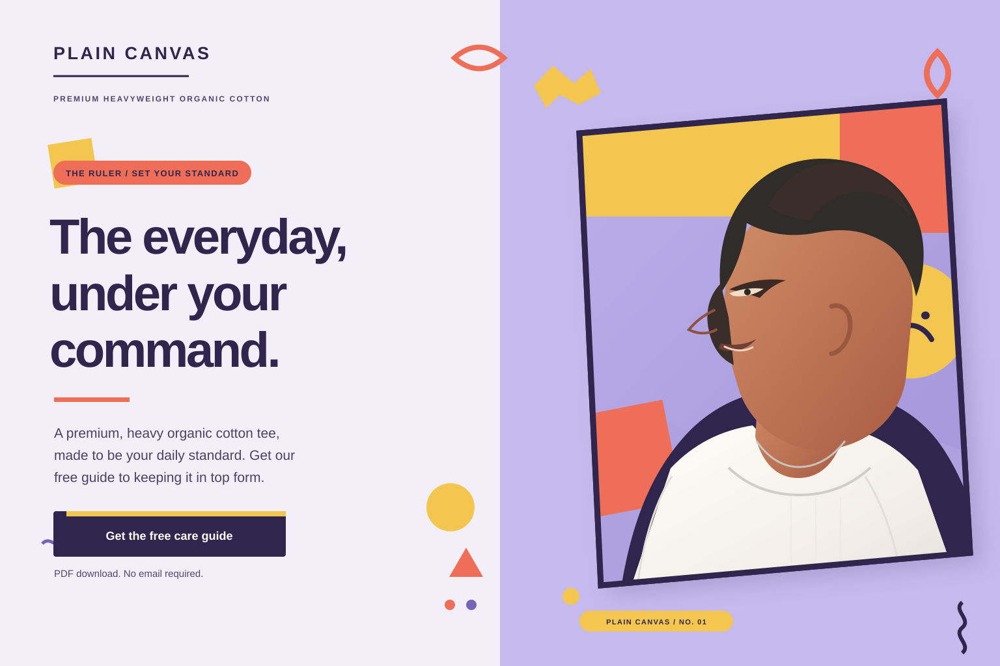

# Ruler
[Back to this section](README.md) · [Home](../README.md)

## What is it?
The Ruler is one of twelve archetypes used in contemporary brand storytelling. In the framework developed for branding by Margaret Mark and Carol S. Pearson, the Ruler represents a desire for order, responsibility, and control: it seeks to lead, set standards, and create stability, and fears chaos or loss of control [1]. The framework adapts the broader idea of recurring archetypal patterns associated with Carl Jung; Jung did not define this specific twelve-archetype brand model [2, 3].

## How do you recognize or use it?
Ruler brands often sound assured, composed, and decisive. To translate that character into design, use clear hierarchy, disciplined grids and alignment, deliberate spacing, and typography and colors that feel confident and considered. Emblems, formal framing, architectural imagery, or refined materials can suggest tradition and authority when they suit the brand. These are possible design cues, not a fixed visual formula.

Use the archetype when an audience values leadership, reliability, security, high standards, or prestige. Make the promise credible with clear information and evidence, and give the audience a direct next step. Avoid making authority feel domineering or exclusionary: the Ruler’s shadow is control for its own sake.

### Example 1

Archetype: Ruler
Style: [Swiss / International Typographic Style](../modernism/swiss-style.md)
Persuasion: Reciprocity
Headline: “Everyday, held to a higher standard.”
CTA: “Get the free care guide” — download the PDF without providing an email.

The Ruler’s promise of high standards comes through in the assured headline, disciplined grid, and considered product presentation. The free guide applies reciprocity by giving visitors useful care advice first; the reassurance makes the exchange clear and low-friction. Image: original vector illustration created for this mockup; the depicted person is fictional, and no external image assets are used.

### Example 2

Archetype: Ruler
Style: [Memphis design](../postmodernism/memphis-group.md)
Persuasion: Reciprocity
Headline: “The everyday, under your command.”
CTA: “Get the free care guide” — download the PDF without providing an email.

The Ruler’s confident promise and decisive CTA remain clear, while the Memphis-inspired colors and tilted portrait frame make authority feel energetic rather than austere. The free care guide applies reciprocity by offering practical value first; the reassurance makes the exchange clear and low-friction. Image: original vector illustration created for this mockup; the depicted person is fictional, and no external image assets are used.

## Sources
- [1] Margaret Mark and Carol S. Pearson, *The Hero and the Outlaw: Building Extraordinary Brands Through the Power of Archetypes* (2001), [Google Books](https://books.google.com/books?vid=ISBN9780071364157).
- [2] Carol S. Pearson, *Awakening the Heroes Within: Twelve Archetypes to Help Us Find Ourselves and Transform Our World*, [HarperCollins](https://www.harpercollins.com/products/awakening-the-heroes-within-carol-s-pearson).
- [3] C. G. Jung, *The Archetypes and the Collective Unconscious*, [Google Books](https://books.google.com/books?vid=ISBN9780691018331).
- [4] Josef Müller-Brockmann, *Grid Systems in Graphic Design*, [Google Books](https://books.google.com/books?vid=ISBN9783721201451).
